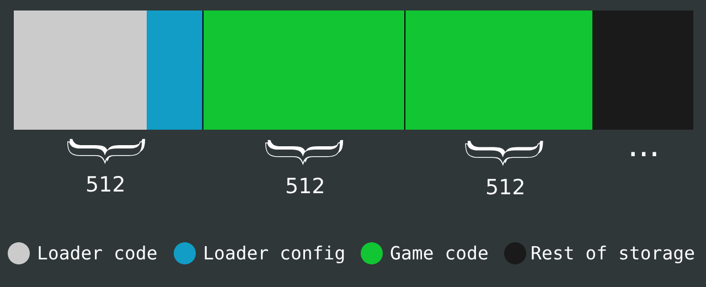

# What is this ?
Real snake is a bootable snake game written in assembly language. The project implements random generation of fruits, sandbox borders (you die if you hit it) and in-code configurable parameters, everything in an image of 1KiB, loader included.

As a matter of curiosity, the `real` of real snake refers to the mode that the processor works at the moment it is powered on (real mode). The real snake runs on a processor working on this mode.

# Challenges
Regardless the fact that the entire project was written in assembly, a few challenges had to be solved to make the real snake work!

## Limited boot memory
The game image itself is pretty small, but the amount of memory that the BIOS loads from my program to memory is even smaller. From my pendrive (device used to run the game on a real hardware), the BIOS will load around by 440 bytes of executable code, however, the game itself is greater than 512 bytes of instructions, making it impossible to the BIOS to load everything automatically.

The solution to this problem was to implement a loader, a program small enough to be loaded by the BIOS, but complete enough to actually load the game from pendrive and make the processor execute it.

## Environment bootstraping
The real mode is the most raw mode that the processor can operate, for that reason, everything had be configured before actually executing the game instructions. This is a simplified TODO list:
<ul>
    <li>Define code segment to make the CPU run the instructions properly</li>
    <li>Define data segment to make data acessible</li>
    <li>Configure the stack segment to make function calls and arguments be possible</li>
    <li>Configure the video mode to display the game</li>
    <li>Additional data structure configurations</li>
</ul>

## Register size
Differently of assembly code running on user land, registers on real mode are only 16 bits wide, so the smart use of data structures and binary representations are vital to the successful implementation of this game.

# Game image structure on pendrive


# Avoiding complexity and memory consumption
In real mode, resources are commonly known to be scarce, even the proper use of memory segments
only grants you 1MiB of addressable memory, such amount that is almost nothing on nowadays systems.

For that and other reasons, the real snake doesn't implement an array that contains a snake's body part on every index, instead, it uses a data structure called `ring buffer`.

The ring buffer itself is a FIFO like data structure, where the end of it is also the beginning. It is used to track down all the player's movements, so on every UP, DOWN, RIGHT or LEFT command, a value encoded in binary containing the location and the new direction is written inside this structure, making it possible to the snake's tail to effectivelly follow the snake's body, decreasing the necessary amount of memory, replacing the 2 bytes for every body part model to a occasional 2 bytes on every direction change model.

# Running it on a real hardware
To make the real snake run on a real hardware, you will need to flash the game image in your pendrive! To do that, you can either create the image from the source code or use the ready-to-go image available inside the `image` directory.

## Creating the image from source code
To build the source code, you will need to have the Nasm assembler installed on your computer. Once the assembler is available system-wide, this shell command should do everything:
```sh
# Assumming you are on real snake's root directory.
# This code is not properly configured to run on non-linux systems
sh build.sh
```
After that, the image will be created inside the `image` directory.

## Flashing the game on pendrive
The BIOS expects the binary instructions to be written in the first sectors of our storage device, for that reason, the load process would fail if we just copy the game image to our pendrive like an ordinary file.

### Pontentially destructive action
`Flashing the game image in the first sectors of the pendrive would overwrite the partition table, making the device unusable for normal file management operations. You can make it usable again by formatting the device, but all your files will be lost.`

`Make sure to make a backup before installing the game on your device.`

### On Linux
Assumming you are inside the `image` directory, this shell command should do the trick:
```sh
sudo dd if=./image of=/dev/sd[X] bs=512 count=4
```
where `[X]` is the letter assigned to your device. Check it by running the `lsblk` or `fdisk -l` commands.

### On Windows
On Windows, choose a capable program to write the game image to your pendrive, like [Rufus](https://rufus.ie/en/) or any other tool available to the system.

## Configuring the BIOS
After plugging the pendrive with the game image on you computer, reboot and enter the BIOS setup. Once there, make sure to enable legacy boot support and make the device holding the game image the top priority on the boot sequence.

After saving the changes and rebooting the computer, the BIOS will load the game from the pendrive and make the processor execute it.

# In-game controls
Once running the game, you can control the snake direction using the W, A, S, D keys. If your snake hit and die or you just want to go back to your system, press the `Z` key, it will instruct the processor to reset and start the boot process again; at this point you can unplug the pendrive from your computer, this will make the BIOS choose the next option in the boot priority, propably being the bootloader of your operating system.
